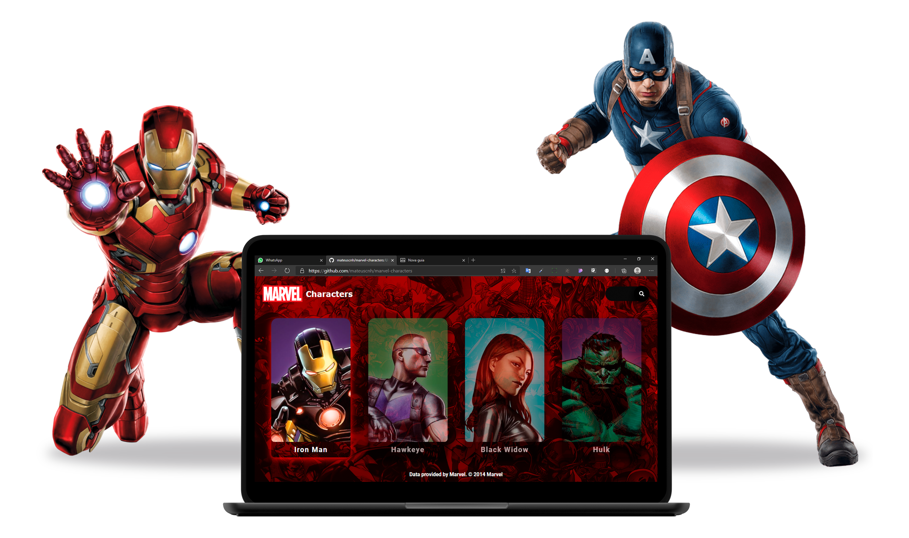

<h1 align="center">
    
</h1>

  <a href="#-technologies">Technologies</a>&nbsp;&nbsp;&nbsp;|&nbsp;&nbsp;&nbsp;
  <a href="#-project">Project</a>

 

  

## 🚀 Technologies

Developed with the following technologies:

- Javascript
- HTML
- CSS

## 💻 Project

Is a search engine for characters from MARVEL using the Marvel API. Created with the intention of practicing and learning new technologies. For you to use, you need the public and private keys of the api.

**Data provided by Marvel. © 2014 Marvel**

