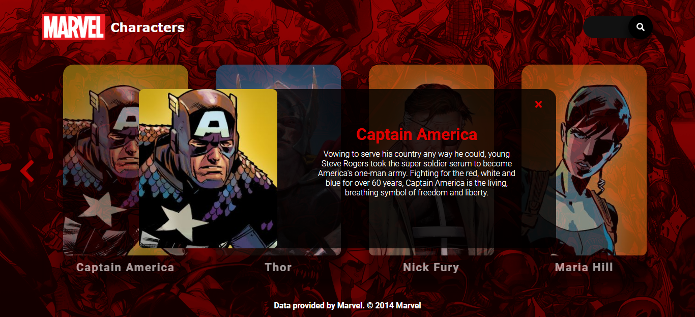

# MARVEL CHARACTER
Using the MARVEL API to get characters. For you to use, you need the public and private keys of the api.

## GAME SCREENS
The 8 main avengers the MCU are loaded.

he name and description of this avenger is shown by clicking it. 

In the search engine you can search for other characters.

And new characters will be added.

**Data provided by Marvel. © 2014 Marvel**

